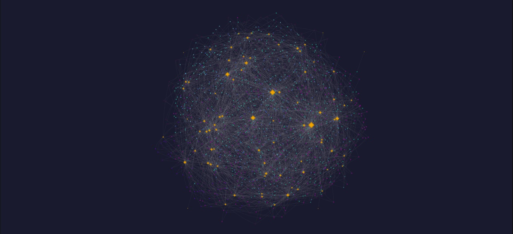

# 🔬 Machine Learning para Predição de Estrutura Cristalina com Features Atômicas

> Iniciação Científica — Universidade de São Paulo (USP)
> Orientador: Prof. Dr. Gustavo Dalpian | Financiamento: CNPq

[](https://python.org)
[](https://jupyter.org)
[](https://scikit-learn.org)
[](https://opensource.org/licenses/MIT)

---

## 📌 Visão Geral

Este repositório reúne o código e os recursos visuais gerados durante a minha iniciação científica sobre o uso de **Machine Learning (ML) para predição de estrutura cristalina de materiais**, baseando-se exclusivamente em **features atômicas** dos elementos químicos que compõem cada material.

O projeto foi motivado pelo alto custo associado às abordagens tradicionais de caracterização de estrutura cristalina — como síntese experimental, cálculos de primeiros princípios e simulações de DFT —, que demandam recursos materiais, computacionais e financeiros expressivos. Em contraste, uma abordagem de ML é significativamente mais rápida e acessível, mesmo que com menor precisão.

> 📄 **Artigo disponível mediante solicitação.** Entre em contato: [giuliano.pepato@usp.br](mailto:giuliano.pepato@usp.br)

---

<!-- SUGESTÃO DE IMAGEM 1:
     Insira aqui um diagrama de pipeline/fluxo do projeto, mostrando:
     Base de dados → Extração de features atômicas → Modelo ML (Random Forest) → Predição de estrutura cristalina
     Ferramentas sugeridas: draw.io, Figma, ou matplotlib.
     Exemplo: 
-->

## 🎯 Objetivos

- Identificar quais **conjuntos de features atômicas** são mais relevantes para a predição de estrutura cristalina;
- Avaliar qual **algoritmo de ML** apresenta melhor desempenho para essa tarefa;
- Comparar os resultados obtidos com trabalhos presentes na **literatura científica**.

---

## 📁 Estrutura do Repositório

```
📦 repositório
 ┣ 📓 ML_crystal_structure.ipynb   # Notebook principal com todo o pipeline de ML
 ┣ 📂 grafos/                      # Arquivos HTML dos grafos interativos
 ┣ 📂 nuvens_probabilidade/        # Arquivos HTML das nuvens de probabilidade
 ┗ 📄 README.md
```

---

## 🚀 Como Usar

1. Clone o repositório:
   ```bash
   git clone https://github.com/GiulianoPepato/Machine-learning-to-predict-crystal_structures.git
   cd seu-repositorio
   ```

2. Instale as dependências (recomenda-se uso de ambiente virtual):
   ```bash
   pip install -r requirements.txt
   ```

3. Abra o notebook principal:
   ```bash
   jupyter notebook ML_crystal_structure.ipynb
   ```

4. Para visualizar os grafos e nuvens de probabilidade, basta abrir os arquivos `.html` em qualquer navegador.

---

## 🔍 Recursos Visuais

### ☁️ Nuvens de Probabilidade

Para compreender as limitações do modelo, desenvolvemos representações visuais das **distribuições de materiais no espaço de números atômicos**.

**Conceito:** Considere um espaço vetorial onde cada dimensão representa o número atômico (Z) de um elemento. Cada material pode ser mapeado a um ponto nesse espaço a partir de sua composição química. Por exemplo, a molécula de água H₂O — composta por H (Z=1) e O (Z=8) — seria representada como o ponto (1, 8, 0).

Como algoritmos de ML não possuem noção química de ordenação, atribuímos **todas as permutações possíveis** dos elementos ao mesmo material, garantindo invariância à ordem. O conjunto de pontos resultante para cada estrutura cristalina forma uma **nuvem de probabilidade**: regiões mais densas indicam maior probabilidade de encontrar materiais daquela estrutura.

Foram geradas nuvens para:
| Prefixo | Descrição |
|---|---|
| `NuPr_<estrutura>` | Dados do **conjunto de treinamento** |
| `NuPr_<estrutura>_val` | Dados do **conjunto de validação** |

> A comparação entre as duas nuvens permite avaliar se os erros do modelo são justificados por sobreposições estatísticas entre as distribuições de treino e validação.

<!-- SUGESTÃO DE IMAGEM 2:
     Insira aqui um exemplo de nuvem de probabilidade gerada (screenshot ou exportação do HTML).
     Exemplo: 
--> 


---

### 🕸️ Grafos de Elementos Químicos

Os grafos foram desenvolvidos para identificar **quais elementos químicos são mais prevalentes em cada estrutura cristalina**, de forma visualmente intuitiva.

**Estrutura do grafo:**
- **Nós pequenos (circulares):** representam os materiais da base de dados;
- **Nós em formato de diamante amarelo:** representam os elementos químicos;
- Cada material se conecta aos seus elementos constituintes;
- **Elementos com mais conexões tornam-se visualmente maiores**, evidenciando sua predominância.

Esses grafos permitem identificar tendências do modelo em associar determinados elementos a estruturas cristalinas específicas.

<!-- SUGESTÃO DE IMAGEM 3:
     Insira aqui um screenshot de um grafo gerado (captura de tela do HTML interativo).
     Exemplo: 
-->

---

## 🤖 Modelo Principal

O algoritmo central utilizado neste projeto é o **Random Forest**, avaliado com diferentes conjuntos de features atômicas. Os resultados são comparados com métricas reportadas na literatura para validar a abordagem.

<!-- SUGESTÃO DE IMAGEM 4:
     Insira aqui uma tabela ou gráfico com os resultados de acurácia do modelo
     (ex: matriz de confusão ou barras comparando acurácias por estrutura cristalina).
     Exemplo: 
-->

---

## 📬 Contato

Dúvidas, sugestões ou interesse no artigo completo?

**Giuliano Pepato**
📧 [giuliano.pepato@usp.br](mailto:giuliano.pepato@usp.br)

---

## 📖 Citação

Se este trabalho foi útil para sua pesquisa, considere citá-lo:

```bibtex
@misc{pepato2026mlcrystal,
  author       = {Giuliano Pepato},
  title        = {Machine Learning para Predição de Estrutura Cristalina com Features Atômicas},
  year         = {2026},
  howpublished = {\url{https://github.com/GiulianoPepato/Machine-learning-to-predict-crystal-structure}},
  note         = {Iniciação Científica, USP, orientador: Prof. Dr. Gustavo Dalpian, financiamento: CNPq}
}
```

---

<div align="center">
  <sub>Desenvolvido com ❤️ e dedicação durante a iniciação científica na USP.</sub>
</div>
